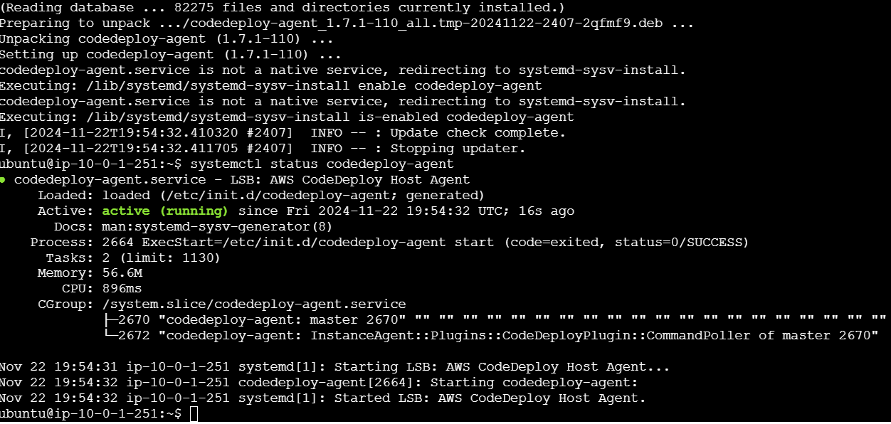
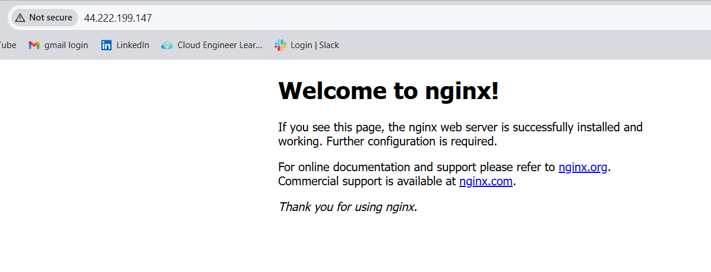
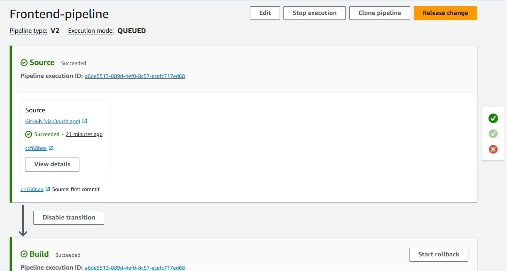
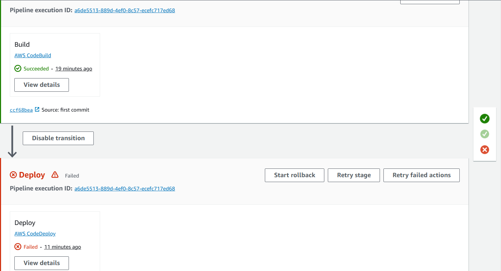
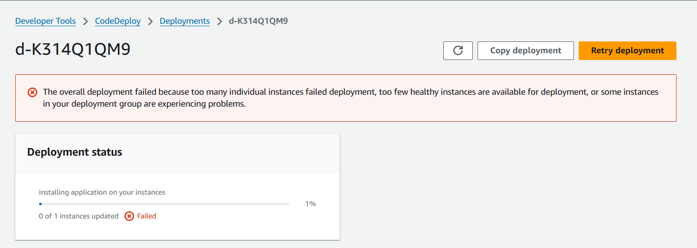
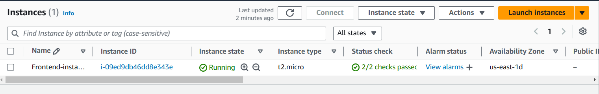

# FRONTEND DEPLOYMENT
## Steps
1. Create IAM Roles
   - EC2 role to access S3 (*EC2RoleForS3*)
   - CodeDeploy Role to attach to codedeploy-to allow it to call AWS services on your behalf(*CodeDeployRoleFrontend*)
2. Create an EC2 to deploy application: *ubuntu* server was used in this project.
3. Attach EC2 role to EC2 to have access to the S3 bucket.
4. Connect to the EC2 instance using **EC2 Instance Connect**.
Run updates using `sudo apt-get update`
5. Add an EC2 user using the command: `sudo adduser ec2-user`
6. Install CodeDeploy agent in the EC2 to ensure there is communication between the EC2 and CodeDeploy.
The steps to install CodeDeploy agent on Ubuntu server are found on this link: [Install the CodeDeploy agent for Ubuntu Server](https://docs.aws.amazon.com/codedeploy/latest/userguide/codedeploy-agent-operations-install-ubuntu.html?source=post_page-----f8ba96c1edd5--------------------------------) or below.
   - `sudo apt update`(already done above)
   - `sudo apt install ruby-full`
   - `sudo apt install wget` - for downloading files from the internet using their urls.
   - `cd /home/ubuntu`
   - `wget https://bucket-name.s3.region-identifier.amazonaws.com/latest/install` where you replace the **bucket-name** with the name of the bucket with the CodeDeploy Resource kit files
   for your region and **region-identifier** with the identifier of your region.
   e.g. `wget https://aws-codedeploy-us-east-1.s3.us-east-1.amazonaws.com/latest/install`
   - `chmod +x ./install` - Adds execute permissions to the *install* file located in the current directory (`./`).
   - To install the latest version of the CodeDeploy agent on Ubuntu server except version 20.04, run the command below:
   `sudo ./install auto`
   - To ensure the CodeDeploy agent is running:
   `systemctl status codedeploy-agent`
   If the CodeDeploy agent is installed and running, you should see a message like **The AWS CodeDeploy agent is running**.
   
7. Create Codepipeline, CodeBuild, CodeDeploy on AWS.
8. Test if the deployment was a success by accessing http://ip-address
My deployment was not a success but searching http://http://44.222.199.147 brought:

9. Test the pipeline by pushing some changes.
Result:

Challenge:

Despite of the instances being healthy

